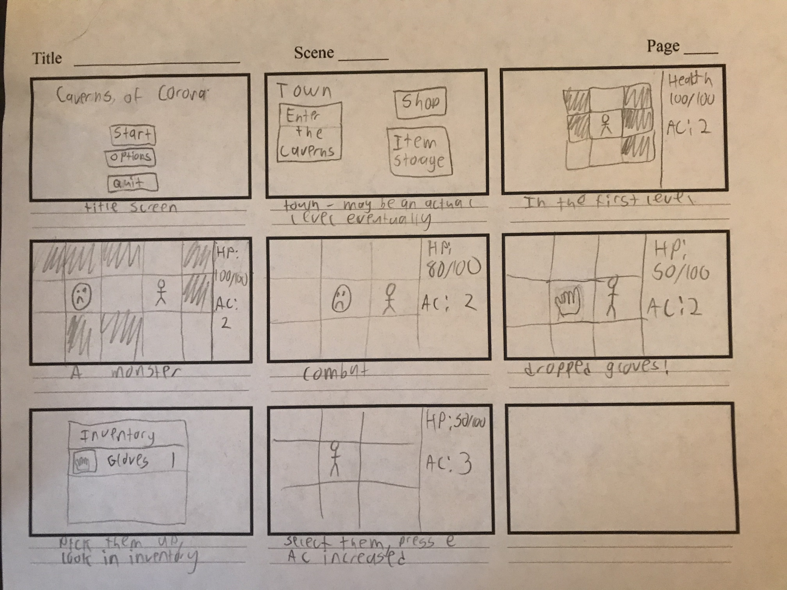

Stephen Wright

# Design Proposal

## Project Description
Caverns of Corona is a traditional rouguelike inspired by games such as Dungeon Crawl Stone Soup. As such, it features turn-based gameplay, procedurally generated levels, and permanent character death. Caverns of Corona will follow the story of an adventurer, as they attempt to reach the bottom of the Caverns, aquire the Crystal Crown, and return safely to the surface. Gaining items along the way, by the end they will be many times stronger than they were originally.
 

## Competitive Analysis
Caverns of Corona was mainly inspired by two different games: Dungeon Crawl Stone Soup, and The Enchanted Cave 2. Of the two, Dungeon Crawl is much closer to a traditional roguelike, as it has true permadeath and is much more challenging. It also has a great character creation system, where you can choose between dozens of races and classes, with races generally providing a greater difference than the class, unlike many games. It also has an interesting system where a character can worship a god chosen from a pantheon of many. This provides many different effects, and each god is uniqe both in how these effects work, and in how they kill you if you displease them. I have always enjoyed these two features, and will strive to implement them in Caverns of Corona. 

There are many similarities between The Enchanted Cave and Dungeon Crawl. They both feature many floors of procedurally generated dungeon, powerful items, and even more powerful enemies. However, it is the differences between them which interest me most. The Enchanted Cave has no permadeath system like that found in more traditional rogulikes. Instead, death only sends you back to the previous day, without any of your equipment. Additionally, there is a fairly common item which allows you to teleport out of the dungeon safely. However, using it destroys most of your items. Together, these features make the game too easy, in my opinion. I may try to implement just the second feature, however. 

## Structural Plan
### Creatures
Both players and enemies will be subclasses of Creature. They will both have a health variable, a location, a sprite, a vision radius, and the ability to move. Enemies will also have a list of their possible combat actions, and a list of their drops (weighted). Players will have their inventory and their equipment. Their equipment will determine how much damage their attacks do. If they have any spells or other abilities, that will be stored here too. 

### Levels
The game is comprised of many levels of the Cavern. Each one is a seperate instance of the Level class. When each level is first reached by the player, its layout is generated. This is stored in a string/text file with various characters for walls, floors, stairs, and other static features. Non-static features such as dropped items are stored in a dictionary, with the location as a key and all items at that location in a set. Enemies are stored in a seperate set, as they store their own location. 

### Items
There are several types of items, each a subclass of the Item class. The main Item class stores a sprite and a name. The Weapon subclass also has how much damage the weapon does and any requirements to equip it. The Armor subclass has its AC, any requirements, and any other effects. Consumables contain the number of remaining uses (1 by default), and the effect they provide. 

## Algorithmic Plan
### Levels
Level generation will take place by repeatedly choosing from a set of premade rooms. The first room will contain the stairs up. A location will randomly be chosen, and a room will attempt to be placed there. After many repeated failed attempts, nearby rooms will be connected. Other static features will then either be placed randomly or at predetermined locations. 

### Enemy Pathfinding
 If an enemy can see the player, it will attempt to pathfind towards it with an A* pathfinding algorithim. Melee enemies will attempt to reach the player, and ranged enemies will try to stay a certain distance away. 

## Timeline
### TP1
- Complete backend
	- Creature class and subclasses
	- Item class and subclasses
- Basic UI/display
	- Display premade maps
	- Have player status displayed on side of screen
	- Inventory of items, showing icons and name
- Begin enemy pathfinding

### TP2
- Complete enemy pathfinding
- Map generation
	- Premade rooms
	- Connection algorithm

### TP3
- Add many new items
	- Some are consumable, with temporary effects
- Add a short-range teleportation ability
- Add traps in the floor to use the enemies' pathfinding against them
 
## Version Control
I am using Github for my documentation. See my project at: [github.com/EuphonyDM/cavernsOfCorona](https://github.com/EuphonyDM/cavernsOfCorona). 

## Storyboard

## TP2 Update
I removed references to the town and shop, as I will no longer be implementing these features. 

## TP3 Update
I updated the TP3 section of the timeline to better reflect my goals. 